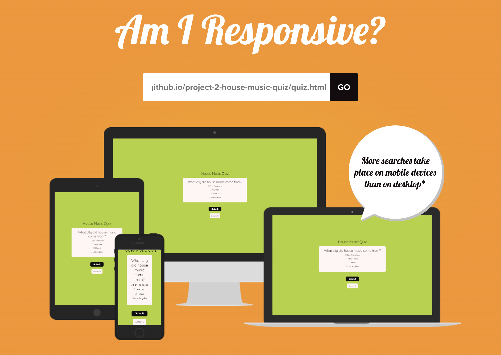
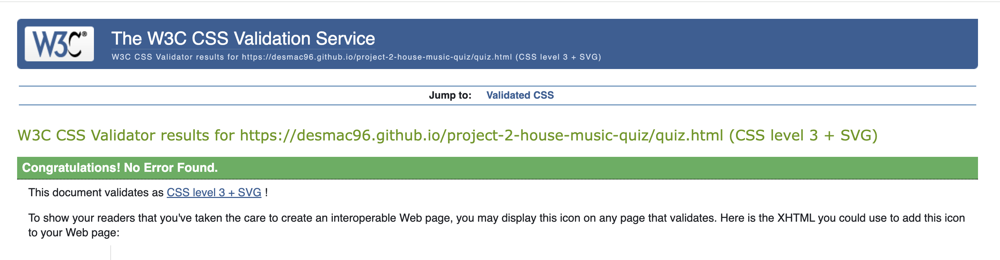
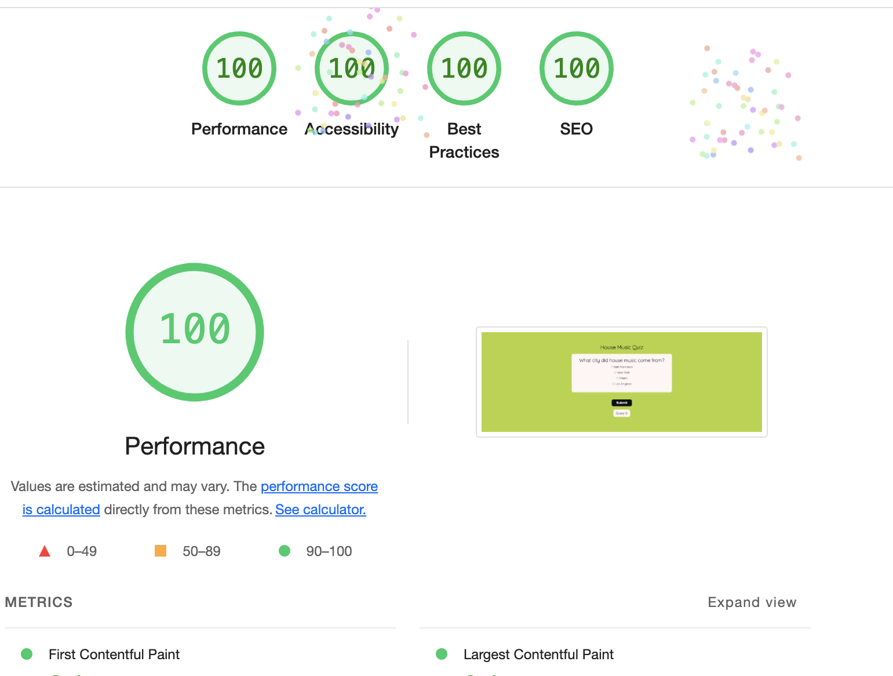
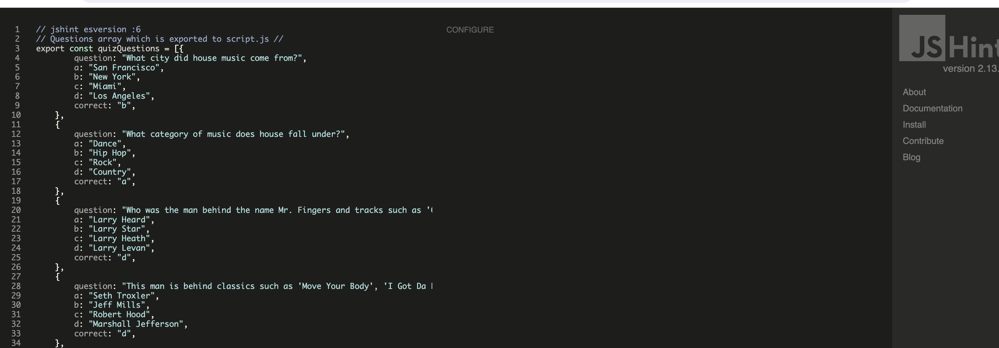
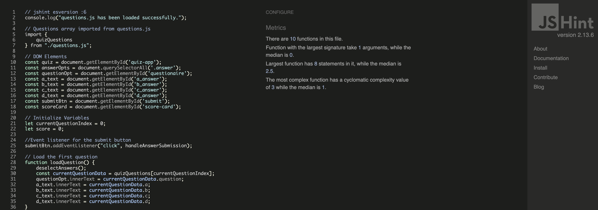

# Project-2-House-Music-Quiz
<h1>House Music Quiz</h1>

<h2>Description</h2>

    The House Music Quiz is a fun and interactive web application designed to test your knowledge of house music. It presents multiple-choice questions about house music history, artists, and festivals. The quiz consists of ten questions aimed at house music fans both young and old.

 

<h2>Existing Features</h2>

<h3>Home Page Introduction</h3>

    <strong>Main Heading:</strong> Clearly states the name of the quiz, "House Music Quiz."

    <strong>Subheading:</strong> Encourages users to test their house music knowledge.

    <strong>Start Button:</strong> A prominent button labeled "Start Quiz" that directs users to the quiz page.

<h3>Quiz Page</h3>

<h4>Question Display</h4>

    <strong>Heading:</strong> "Question Section" indicates the start of the quiz.

    <strong>Question Text:</strong> Dynamically displays each quiz question from a predefined list.

    <strong>Answer Options:</strong>
    <ul>
        <li>Four radio buttons labeled "a," "b," "c," and "d" for each possible answer.</li>
        <li>Labels associated with each radio button display the answer text.</li>
    </ul>

<h3>Quiz Functionality</h3>

<h4>Answer Selection</h4>

Users select an answer by clicking one of the radio buttons.

<h4>Submit Button</h4>

A button labeled "Submit" allows users to submit their selected answer.

Upon submission, the quiz checks the answer and updates the score.

<h4>Score Display</h4>

    A live score display shows the user's current score throughout the quiz. The score updates immediately after each question submission.

<h3>Question Navigation</h3>

<h4>Automatic Question Progression</h4>

    After submitting an answer, the quiz automatically loads the next question. If all questions are answered, the quiz displays the final score and results.

<h4>Results Display</h4>

    At the end of the quiz, a summary of the user's score out of the total questions is shown, encouraging users with a message based on their performance.

<h3>Restart Functionality</h3>

    <strong>Restart Button:</strong> A button labeled "Restart Game" appears at the end of the quiz. Clicking this button reloads the quiz, allowing users to take it again.

<h3>Feedback Mechanisms</h3>

<h4>Answer Validation</h4>

    If no answer is selected when the user attempts to submit, an alert prompts them to choose an answer.

<h4>Score Incrementation</h4>

    Correct answers increment the score, providing immediate feedback on performance.

<h3>Responsive Design</h3>

    The quiz interface is designed to be responsive, ensuring a seamless user experience across different devices and screen sizes.

<h3>Styling and User Interface</h3>

<h4>Visual Design</h4>

    The quiz container is styled with a clean and engaging look, using a light color scheme for the background and contrasting elements. The "Start Quiz" and "Submit" buttons are styled in black to improve the Lighthouse rating.

<h4>Font and Layout</h4>

    The main font used in this website is "Quicksand," imported through Google Fonts. This font was chosen for its modern and clean appearance, which suits the interactive and engaging nature of the quiz. Sans Serif is used as a fallback in case the font is not imported correctly.

    By providing a straightforward, engaging, and interactive experience, the House Music Quiz effectively tests users' knowledge of house music while maintaining a user-friendly and visually appealing interface.

<h2>First Time Visitor Goals</h2>

As a first-time visitor, I want to:

<ul>
    <li>Easily understand the main purpose of the website and learn more about what the quiz entails.</li>
    <li>Effortlessly navigate through the website and find the quiz section without any confusion.</li>
    <li>Have a clear and intuitive user interface that guides me through starting and completing the quiz.</li>
    <li>Feel encouraged to participate in the quiz through engaging and appealing visual elements.</li>
    <li>Receive instant feedback on my performance to understand how well I know house music.</li>
</ul>

<h2>Returning Visitor Goals</h2>

As a returning visitor, I want to:

<ul>
    <li>Find the quiz quickly and start it with minimal navigation since I am already familiar with the site layout.</li>
    <li>Look for any new features or sections added to the website that enhance my experience or provide additional value.</li>
    <li>Revisit sections of the website that I found interesting or useful during my previous visit.</li>
</ul>

<h2>Frequent Visitor Goals</h2>

As a frequent visitor, I want to:

<ul>
    <li>Quickly start the quiz without any hassle, as I am already familiar with the website layout and navigation.</li>
    <li>See new and updated quiz questions to keep the experience fresh and challenging.</li>
</ul>

<h2>Design</h2>

<ul>
    <h3>Colour Scheme</h3>
    <li>The primary colors used are green and white. Green is used for the background, providing a vibrant and energetic feel, while white is used for the text and quiz container to ensure readability and contrast.</li>
</ul>

<ul>
    <h3>Typography</h3>
    <li>The main font used in this website is "Quicksand," imported through Google Fonts. This font was chosen for its modern and clean appearance, which suits the interactive and engaging nature of the quiz. Sans Serif is used as a fallback in case the font is not imported correctly.</li>
</ul>

<ul>
    <h3>Imagery</h3>
    <li>Imagery is used minimally to maintain focus on the quiz content. The background image is designed to catch the user's eye and create an engaging atmosphere without distracting from the quiz questions.</li>
</ul>

<h2>Features</h2>
<ul>
    <li>Responsive on all devices</li>
    <li>Interactive quiz elements</li>
    <li>Instant feedback on answers</li>
    <li>Score tracking and display</li>
    <li>Option to restart the quiz</li>
</ul>

<h2>Technologies Used</h2>
<ul>
    <li>HTML5</li>
    <li>CSS3</li>
    <li>JavaScript</li>
</ul>

<h2>Frameworks, Libraries & Programs Used</h2>
<ul>
    <li><strong>Google Fonts:</strong> Google Fonts were used to import the 'Quicksand' font into the style.css file, which is used throughout the project.</li>
    <li><strong>Balsamiq:</strong> Balsamiq was used to create wireframes during the planning phase of the project.
    </li> 
    <li><strong>Font Awesome:</strong> Font Awesome was used throughout the website to add icons for aesthetic and UX purposes.</li>
    <li><strong>Git:</strong> Git was used for version control by utilizing the Gitpod terminal to commit to Git and push to GitHub.</li>
    <li><strong>GitHub:</strong> GitHub is used to store the project's code after being pushed from Git.</li>
</ul>

<h2>Testing</h2>
<ul>
    <li>
        The W3C Markup Validator and W3C CSS Validator Services were used to validate every page of the project to ensure there were no syntax errors.
        
    </li>
    <li>
        The site was also tested using devtools Lighthouse. Here are the results:
        <ul>
            <li>Performance: 100</li>
            <li>Accessibility: 100</li>
            <li>Best Practices: 100</li>
            <li>SEO: 100</li>
        </ul>
        
    </li>
    <li>
        JavaScript functionality was tested, and no errors were found.
        
        
    </li>
    <li>
        Responsive design was tested using Am I Responsive. The site looks great on all devices.
    </li>
</ul>

<h3>Testing User Stories from User Experience (UX) Section</h3>

<h4>First Time Visitor Goals</h4>
<ul>
    <li>As a First Time Visitor, I want to easily understand the main purpose of the site and learn more about what the quiz entails.</li>
    <ul>
        <li>Upon entering the site, the user is greeted with a clear and prominent "Start Quiz" button.</li>
        <li>The homepage clearly states that the quiz is about testing knowledge of house music.</li>
        <li>The user has the option to click the "Start Quiz" button to immediately begin the quiz.</li>
    </ul>
</ul>

<ul>
    <li>As a First Time Visitor, I want to be able to easily navigate throughout the site to find content.</li>
    <ul>
        <li>The site is designed to be simple and straightforward, so users are not distracted. The main call to action is the "Start Quiz" button.</li>
    </ul>
</ul>

<h4>Returning Visitor Goals</h4>
<ul>
    <li>As a returning visitor, I want to see if there are any new quizzes or updates to the existing quiz since my last visit.</li>
    <ul>
        <li>The homepage or quiz page will display any new or updated quizzes.</li>
    </ul>
</ul>

<ul>
</ul>

<h4>Frequent User Goals</h4>
<ul>
    <li>As a Frequent User, I want to see new and updated quiz questions to keep the experience fresh and challenging.</li>
    <ul>
        <li>The quiz database should be regularly updated with new questions to maintain user engagement.</li>
    </ul>
</ul>

<h3>Further Testing</h3>
<ul>
    <li>The website was tested on Google Chrome, Internet Explorer, Microsoft Edge, and Safari browsers.</li>
    <li>The website was viewed on a variety of devices such as desktops, laptops, tablets, and mobile phones.</li>
    <li>A large amount of testing was done to make sure all links are working correctly.</li>
    <li>Friends and family members were asked to review the site and documentation to point out any bugs and/or user experience issues.</li>
</ul>

<h3>Known Bugs</h3>

There are no known bugs

<h2>Deployment</h2>

<h3>GitHub Pages</h3>
<ul>
    <li>1. Log in to GitHub and locate the GitHub Repository.</li>
    <li>2. At the top of the Repository (not top of the page), locate the "Settings" button on the menu.</li>
    <li>3. Scroll down the Settings page until you locate the "GitHub Pages" section.</li>
    <li>4. Under "Source", click the dropdown called "None" and select "Master Branch."</li>
    <li>5. The page will automatically refresh.</li>
    <li>6. Scroll back down through the page to locate the now published site link in the "GitHub Pages" section.</li>
</ul>

<h3>Forking the GitHub Repository</h3>
<ul>
    <li>By forking the GitHub Repository, we make a copy of the original repository on our GitHub account to view and/or make changes without affecting the original repository by using the following steps:</li>
    <li>1. Log in to GitHub and locate the GitHub Repository.</li>
    <li>2. At the top of the Repository (not top of page) just above the "Settings" button on the menu, locate the "Fork" button.</li>
    <li>3. You should now have a copy of the original repository in your GitHub account.</li>
</ul>

<h3>Making a Local Clone</h3>
<ul>
    <li>1. Log in to GitHub and locate the GitHub Repository.</li>
    <li>2. Under the repository name, click "Clone or download."</li>
    <li>3. To clone the repository using HTTPS, under "Clone with HTTPS", copy the link.</li>
    <li>4. Open Git Bash.</li>
    <li>5. Change the current working directory to the location where you want the cloned directory to be made.</li>
    <li>6. Type git clone, and then paste the URL you copied in Step 3.
    $ git clone https://github.com/YOUR-USERNAME/YOUR-REPOSITORY</li>
    <li>7. Press Enter. Your local clone will be created.</li>
</ul>
<ul>
    <li>$ git clone https://github.com/YOUR-USERNAME/YOUR-REPOSITORY</li>
    <li>> Cloning into `CI-Clone`...</li>
    <li>> remote: Counting objects: 10, done.</li>
    <li>> remote: Compressing objects: 100% (8/8), done.</li>
    <li>> remove: Total 10 (delta 1), reused 10 (delta 1)</li>
    <li>> Unpacking objects: 100% (10/10), done.</li>
</ul>

<h2>Credits</h2>

<h3>Code</h3>
<ul>
    
I studied similar projects on Youtube and Peer code review before designing the quiz.
</ul>

<h3>Content</h3>
<ul>
    <li>All content was written by the developer.</li>
</ul>

<h3>Additional Note</h3>

This project was started over a year ago. I took a break from coding for over a year to pursue a career in music.

<h3>Acknowledgements</h3>
<ul>
    <li>My mentor for continuous helpful feedback.</li>
    <li>Tutor support at Code Institute for their support.</li>
    <li>I used Chat GPT to breakdown and help me understand Javascript and why I was using certain fuctions and how to use them. </li>
</ul>
